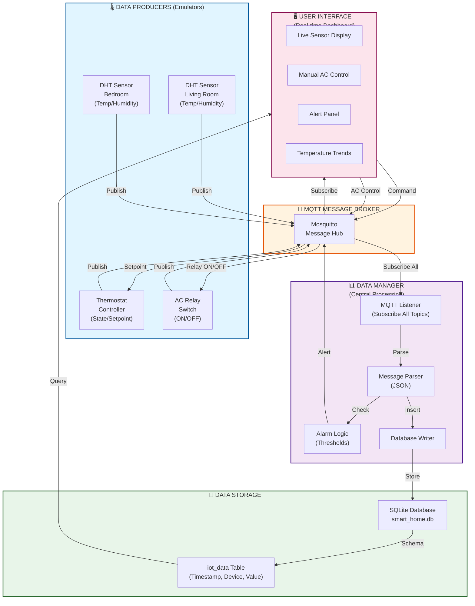

# Architecture Diagram - Smart Home Climate Control System

## System Architecture



## Key Components

| Component         | Role                             | Protocol              |
| ----------------- | -------------------------------- | --------------------- |
| **Emulators**     | Simulate IoT sensors & actuators | MQTT Pub/Sub          |
| **MQTT Broker**   | Central message hub              | TCP/1883              |
| **Data Manager**  | Listens, parses, stores, alerts  | MQTT Subscribe        |
| **SQLite DB**     | Persistent data storage          | SQL                   |
| **GUI Dashboard** | Real-time monitoring & control   | MQTT + Database Query |

## Data Flow

1. **Emulator → Broker**: DHT/Thermostat/Relay publish sensor readings (every 5-15 sec)
2. **Broker → Manager**: Manager subscribes to `home/#` receives all messages
3. **Manager → Database**: Parses JSON, inserts into SQLite with timestamp
4. **Manager → Alerts**: Checks temperature thresholds, publishes alerts if exceeded
5. **Manager → Broker**: Alert messages published to `home/alerts/temperature`
6. **Broker → GUI**: GUI subscribes to alerts and all home topics
7. **GUI → Database**: Queries latest sensor values every 1 second
8. **GUI → Broker**: User sends AC commands back to broker
9. **Broker → Thermostat**: Thermostat receives and processes control commands

## Network Topics

```
home/
├── living_room/
│   └── dht              # {"temperature": 22.5, "humidity": 55, ...}
├── bedroom/
│   └── dht              # {"temperature": 21.0, "humidity": 60, ...}
├── thermostat/
│   └── status           # {"state": "HEATING", "setpoint": 22, ...}
├── ac/
│   ├── relay/
│   │   ├── status       # {"relay_state": "ON", ...}
│   │   └── command      # {"state": "ON"} (from GUI)
│   └── control          # {"state": "HEATING", "setpoint": 22} (from GUI)
└── alerts/
    └── temperature      # {"severity": "warning", "device": "...", ...}
```
