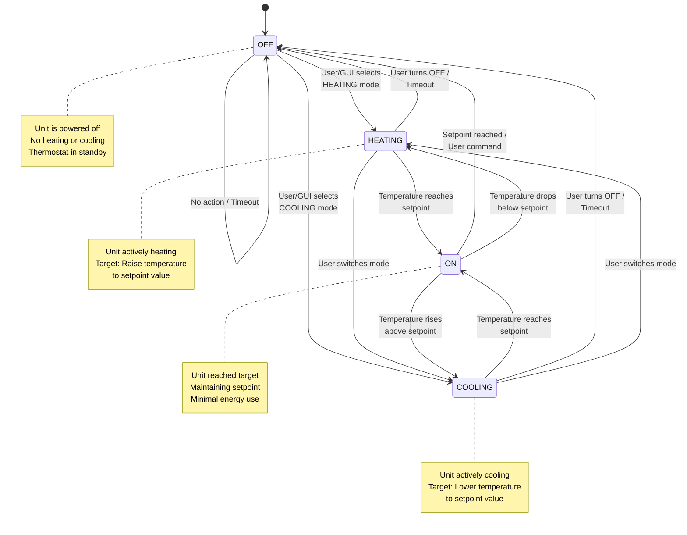
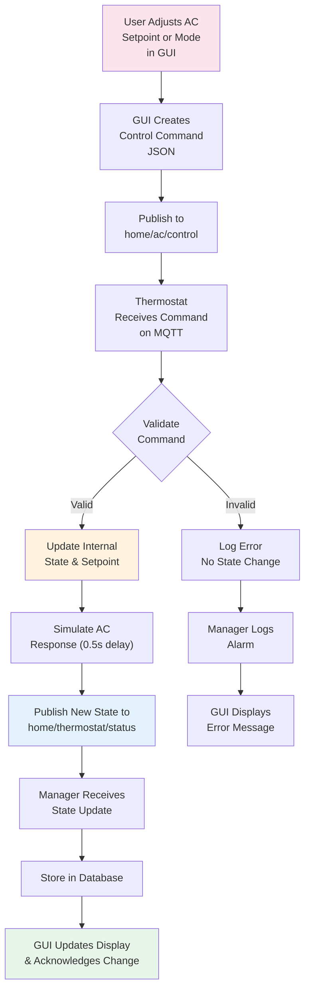
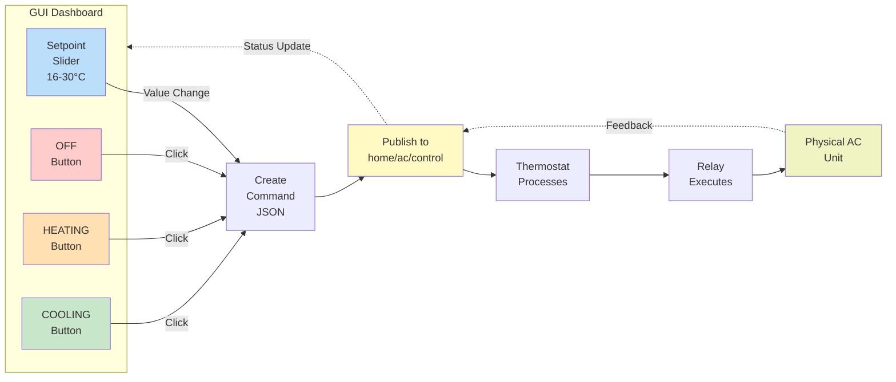

# AC Unit State Machine Diagram

## Thermostat State Transitions



## AC Relay Control Flow



## GUI Control Interface



## Setpoint Adjustment Timeline

```mermaid
timeline
    title Temperature Control Timeline (Setpoint 22°C)

    section Initial State
        14:30:00 : Unit OFF : No heating/cooling

    section User Action
        14:30:05 : User sets HEATING mode in GUI
        14:30:05 : Setpoint set to 22°C

    section Command Transmission
        14:30:06 : Command published to MQTT
        14:30:06 : Thermostat receives command

    section AC Response
        14:30:06.5 : Thermostat confirms state change
        14:30:07 : AC unit relay activated (ON)
        14:30:07 : Physical heating begins

    section Monitoring
        14:30:10 : Temperature: 18°C (below target, heating)
        14:30:15 : Temperature: 19°C
        14:30:20 : Temperature: 20°C
        14:30:25 : Temperature: 21°C
        14:30:30 : Temperature: 22°C (target reached!)

    section Steady State
        14:30:35 : Unit ON (maintaining 22°C)
        14:30:40 : Unit ON
        14:31:00 : Unit ON (still holding)
```
