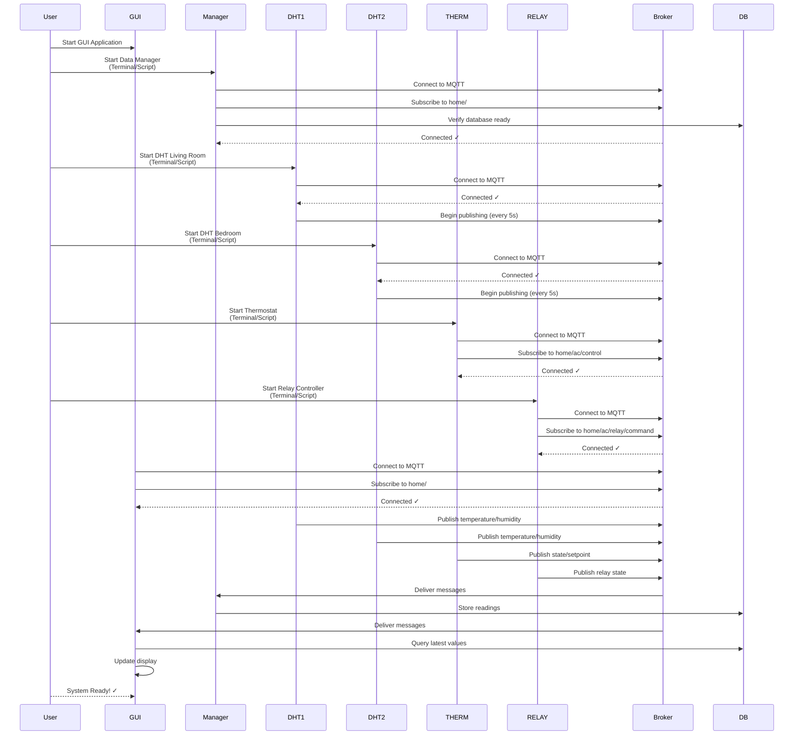
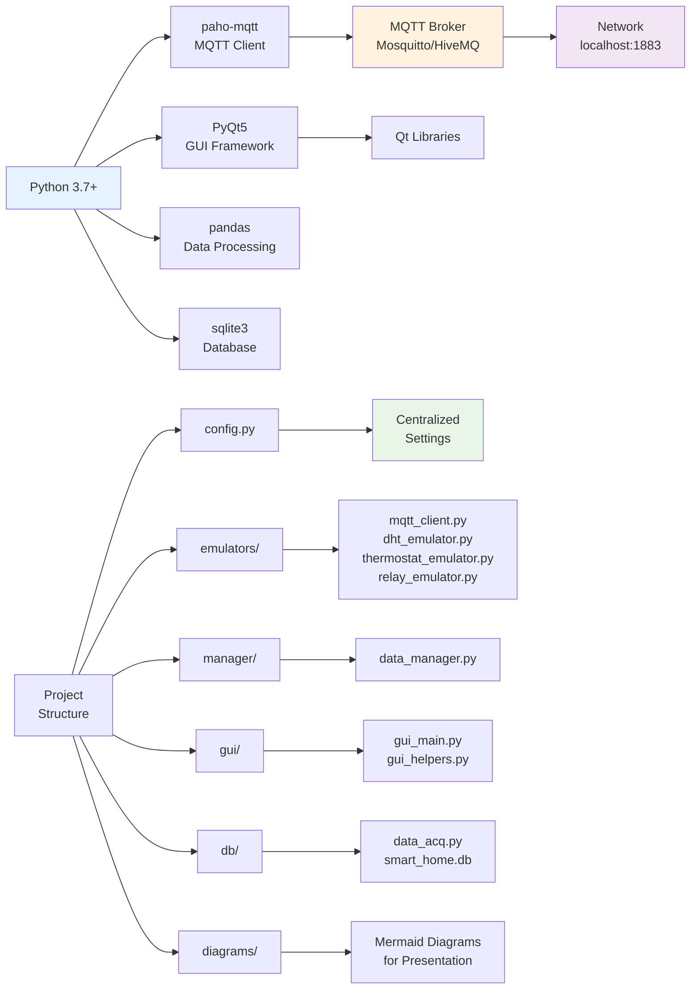
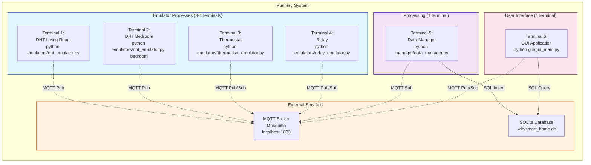

# System Timeline & Component Overview

## Project Timeline

```mermaid
timeline
    title Smart Home Climate Control System - Development Timeline

    section Requirements & Planning
        Define Project Scope : Smart Home Climate Control System
        Identify Components : 3 Emulators, Manager, GUI, Database
        Design Architecture : MQTT-based distributed system

    section Phase 1: Setup
        Create Folder Structure : Organized module layout
        Configure System : config.py with all settings
        Setup Database : SQLite schema and operations

    section Phase 2: Emulators
        Build DHT Sensor : Temperature/Humidity generation
        Build Thermostat : AC state and control
        Build Relay Controller : ON/OFF switching

    section Phase 3: Data Processing
        Create Manager App : MQTT listener and parser
        Implement Alarms : Temperature threshold checks
        Store Data : Auto-insert to SQLite

    section Phase 4: UI Layer
        Design GUI Layout : PyQt5 dock widgets
        Implement Real-time Updates : 1Hz refresh timer
        Add Manual Controls : Setpoint slider and buttons

    section Phase 5: Documentation
        Create Architecture Diagrams : Mermaid visualizations
        Write Project Summary : Complete documentation
        Prepare README : Quick start guide

    section Phase 6: Testing & Integration
        Component Testing : Each module independently
        Integration Testing : Full system end-to-end
        Performance Testing : Latency and throughput

    section Phase 7: Delivery
        Create Presentation : 10-12 slides with diagrams
        Record Demo Video : 5-7 minute walkthrough
        Package Repository : GitHub with all code
```

## Component Startup Sequence

```mermaid
sequenceDiagram
    participant User
    participant GUI
    participant Manager
    participant DHT1
    participant DHT2
    participant THERM
    participant RELAY
    participant Broker
    participant DB

    User->>GUI: Start GUI Application

    User->>Manager: Start Data Manager<br/>(Terminal/Script)
    Manager->>Broker: Connect to MQTT
    Manager->>Broker: Subscribe to home/#
    Manager->>DB: Verify database ready
    Broker-->>Manager: Connected ✓

    User->>DHT1: Start DHT Living Room<br/>(Terminal/Script)
    DHT1->>Broker: Connect to MQTT
    Broker-->>DHT1: Connected ✓
    DHT1->>Broker: Begin publishing (every 5s)

    User->>DHT2: Start DHT Bedroom<br/>(Terminal/Script)
    DHT2->>Broker: Connect to MQTT
    Broker-->>DHT2: Connected ✓
    DHT2->>Broker: Begin publishing (every 5s)

    User->>THERM: Start Thermostat<br/>(Terminal/Script)
    THERM->>Broker: Connect to MQTT
    THERM->>Broker: Subscribe to home/ac/control
    Broker-->>THERM: Connected ✓

    User->>RELAY: Start Relay Controller<br/>(Terminal/Script)
    RELAY->>Broker: Connect to MQTT
    RELAY->>Broker: Subscribe to home/ac/relay/command
    Broker-->>RELAY: Connected ✓

    GUI->>Broker: Connect to MQTT
    GUI->>Broker: Subscribe to home/#
    Broker-->>GUI: Connected ✓

    DHT1->>Broker: Publish temperature/humidity
    DHT2->>Broker: Publish temperature/humidity
    THERM->>Broker: Publish state/setpoint
    RELAY->>Broker: Publish relay state

    Broker->>Manager: Deliver messages
    Manager->>DB: Store readings

    Broker->>GUI: Deliver messages
    GUI->>DB: Query latest values
    GUI->>GUI: Update display

    User-->>GUI: System Ready! ✓
```

## System Dependencies

```mermaid
graph LR
    A["Python 3.7+"] --> B["paho-mqtt<br/>MQTT Client"]
    A --> C["PyQt5<br/>GUI Framework"]
    A --> D["pandas<br/>Data Processing"]
    A --> E["sqlite3<br/>Database"]

    B --> F["MQTT Broker<br/>Mosquitto/HiveMQ"]
    C --> G["Qt Libraries"]

    F --> H["Network<br/>localhost:1883"]

    I["Project<br/>Structure"] --> J["config.py"]
    I --> K["emulators/"]
    I --> L["manager/"]
    I --> M["gui/"]
    I --> N["db/"]
    I --> O["diagrams/"]

    J --> P["Centralized<br/>Settings"]

    K --> Q["mqtt_client.py<br/>dht_emulator.py<br/>thermostat_emulator.py<br/>relay_emulator.py"]

    L --> R["data_manager.py"]

    M --> S["gui_main.py<br/>gui_helpers.py"]

    N --> T["data_acq.py<br/>smart_home.db"]

    O --> U["Mermaid Diagrams<br/>for Presentation"]

    style A fill:#e3f2fd
    style F fill:#fff3e0
    style H fill:#f3e5f5
    style P fill:#e8f5e9
```

## Runtime Architecture

```mermaid
graph TB
    subgraph Running["Running System"]
        direction TB
        subgraph Emulators["Emulator Processes (3-4 terminals)"]
            E1["Terminal 1:<br/>DHT Living Room<br/>python emulators/dht_emulator.py"]
            E2["Terminal 2:<br/>DHT Bedroom<br/>python emulators/dht_emulator.py bedroom"]
            E3["Terminal 3:<br/>Thermostat<br/>python emulators/thermostat_emulator.py"]
            E4["Terminal 4:<br/>Relay<br/>python emulators/relay_emulator.py"]
        end

        subgraph Processing["Processing (1 terminal)"]
            M["Terminal 5:<br/>Data Manager<br/>python manager/data_manager.py"]
        end

        subgraph Interface["User Interface (1 terminal)"]
            G["Terminal 6:<br/>GUI Application<br/>python gui/gui_main.py"]
        end

        subgraph External["External Services"]
            B["MQTT Broker<br/>Mosquitto<br/>localhost:1883"]
            DB["SQLite Database<br/>./db/smart_home.db"]
        end
    end

    E1 -.->|MQTT Pub| B
    E2 -.->|MQTT Pub| B
    E3 -.->|MQTT Pub/Sub| B
    E4 -.->|MQTT Pub/Sub| B

    M -.->|MQTT Sub| B
    M -->|SQL Insert| DB

    G -.->|MQTT Pub/Sub| B
    G -->|SQL Query| DB

    style Emulators fill:#e1f5ff,stroke:#01579b
    style Processing fill:#f3e5f5,stroke:#4a148c
    style Interface fill:#fce4ec,stroke:#880e4f
    style External fill:#fff3e0,stroke:#e65100
```
